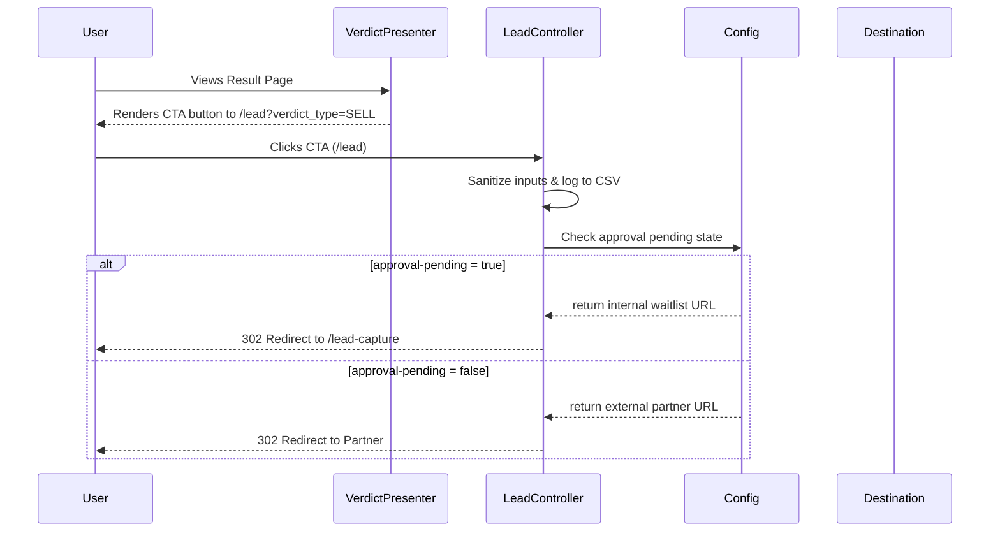

# Lead Flow Architecture

## 1. Overview
All outbound affiliate links and internal lead collections are unified through a single tracking endpoint: `/lead`.
This allows us to track click-through rates (CTR), log events to CSV, sanitize inputs, and dynamically route traffic depending on affiliate approval status.

## 2. Dynamic Routing (`PartnerRoutingConfig`)
The destination logic is decoupled from the UI. `PartnerRoutingConfig` determines the final redirect target based on the `app.partner.approval-pending` flag.

### A. Pre-Approval Phase (`approval-pending=true`)
- Affiliate partners are NOT yet approved.
- All `/lead` requests fall back to `/lead-capture` (internal waitlist form).
- Allows us to collect leads manually and test CTR without a live partner.

### B. Post-Approval Phase (`approval-pending=false`)
- Affiliate partners are approved.
- `/lead` requests redirect directly to external partners (e.g., Peddle, RepairPal).
- Redirection target relies on the `verdict_type` (SELL vs FIX).

## 3. Flow Diagram

## 4. Security & Hardening Measures

- **No Open Redirect:** Redirect targets are exclusively derived from `application.yml` config (`PartnerRoutingConfig`). User inputs are never used as base URLs.
- **URL Encoding:** All parameters forwarded in redirect URLs are encoded using `URLEncoder.encode` (UTF-8) to prevent broken links or HTTP Response Splitting.
- **CSV Injection Defense:** All logged parameters are sanitized. Any string starting with `=`, `+`, `-`, `@`, or `\t` is prefixed with a single quote `'`.
- **Null Byte Removal:** Replaces `\u0000` to protect logging infrastructure and parsers.
- **Cache Prevention:** The `/lead` endpoint sets strict `Cache-Control: no-store, no-cache, max-age=0` headers so redirects are never cached by the browser, ensuring 100% click tracking.
