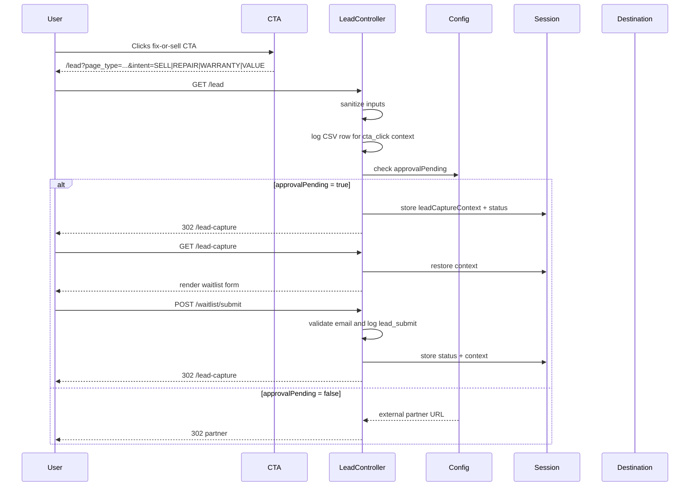

# Lead Flow Architecture

Primary tracking reference: see `docs/TRACKING_SPEC.md`.

## 1. Overview
All monetization and waitlist handoffs run through one router: `/lead`.

This router has 3 jobs:
- sanitize and log CTA context
- decide whether traffic goes to an internal waitlist or an external partner
- preserve attribution context when the site is still in waitlist mode

## 2. Routing Modes (`PartnerRoutingConfig`)

### A. Pre-Approval Phase (`approvalPending=true`)
- All `/lead` traffic is redirected to the internal waitlist at `/lead-capture`.
- The redirect target is always the clean canonical path: `/lead-capture`.
- CTA context is stored in session before redirect so the waitlist form still knows:
  - `verdict`
  - `brand`
  - `model`
  - `pageType`
  - `detail`
  - `placement`
  - `intent`
  - `referrerPath`
- Legacy query-style waitlist URLs such as `/lead-capture?verdict=TIME_BOMB&brand=toyota` are normalized back to `/lead-capture`.

### B. Post-Approval Phase (`approvalPending=false`)
- `/lead` routes directly to an external partner URL.
- Redirect choice is based on normalized intent:
  - `SELL` -> `sellPartnerUrl`
  - `REPAIR` -> `repairPartnerUrl`
  - `WARRANTY` -> `warrantyPartnerUrl`
  - `VALUE` -> `marketValuePartnerUrl`

## 3. Canonical Intent Taxonomy
This is the only valid lead intent taxonomy.

- `SELL`
- `REPAIR`
- `WARRANTY`
- `VALUE`
- `WAITLIST`

Notes:
- `FIX` is normalized to `REPAIR`.
- Lowercase or mixed-case variants are normalized in `LeadController`.
- New CTA surfaces should emit the canonical uppercase values directly instead of relying on fallback normalization.

## 4. Flow Diagram

```mermaid
sequenceDiagram
    participant User
    participant CTA
    participant LeadController
    participant Config
    participant Session
    participant Destination

    User->>CTA: Clicks fix-or-sell CTA
    CTA-->>User: /lead?page_type=...&intent=SELL|REPAIR|WARRANTY|VALUE
    User->>LeadController: GET /lead
    LeadController->>LeadController: sanitize inputs
    LeadController->>LeadController: log CSV row for cta_click context
    LeadController->>Config: check approvalPending
    alt approvalPending = true
        LeadController->>Session: store leadCaptureContext + status
        LeadController-->>User: 302 /lead-capture
        User->>LeadController: GET /lead-capture
        LeadController->>Session: restore context
        LeadController-->>User: render waitlist form
        User->>LeadController: POST /waitlist/submit
        LeadController->>LeadController: validate email and log lead_submit
        LeadController->>Session: store status + context
        LeadController-->>User: 302 /lead-capture
    else approvalPending = false
        Config-->>LeadController: external partner URL
        LeadController-->>User: 302 partner
    end
```

## 5. Event Model

### A. Frontend GA4 Events
- `calculator_submit`
  - source: `index.jte`
  - meaning: user submitted the calculator form
- `verdict_shown`
  - source: `result.jte`
  - meaning: the calculator result page rendered for the owner view
- `cta_click`
  - source: `layout.jte`
  - meaning: user clicked a `/lead` CTA
  - key fields: `page_type`, `intent`, `verdict_state`, `placement`
- `lead_capture_view`
  - source: `pages/lead_capture.jte`
  - meaning: waitlist page rendered
  - key fields: `page_type`, `verdict_state`, `brand`, `model`, `detail`, `placement`, `intent`, `status`
- `lead_submit`
  - source: `pages/lead_capture.jte`
  - meaning: user submitted the waitlist form
  - key fields sent client-side are lightweight; full attribution is preserved server-side in CSV
- `share_open`
  - source: `result.jte`
  - meaning: user opened the share action for a diagnostic receipt

### B. CSV Lead Log
- file: `automoneypit-leads.csv`
- logger: `CSV_LEAD_LOGGER`
- schema:
```text
timestamp,event_type,page_type,intent,verdict,brand,model,detail,referrer_path,placement
```

Current server-side rows:
- `/lead` logs the incoming CTA context
- `/waitlist/submit` logs `lead_submit`

The CSV log is the source of truth for attribution because it keeps the preserved waitlist context that the frontend event payload does not fully include.

## 6. Waitlist Canonicalization Rules
- `/lead-capture` must remain `noindex, nofollow`
- `/lead-capture` must emit a canonical pointing to itself
- `/lead-capture?...` variants must redirect to clean `/lead-capture`
- session IDs must not leak into the URL

Implementation notes:
- `server.servlet.session.tracking-modes=cookie` is required so Tomcat does not append `;jsessionid=...`
- `LeadController` sets `X-Robots-Tag: noindex, nofollow, noarchive`
- `layout.jte` renders `<meta name="robots" content="noindex, nofollow">` when `noindex=true`

## 7. How To Read The Funnel
Use the funnel in this order:

1. `verdict_shown`
2. `cta_click`
3. `lead_capture_view`
4. `lead_submit`
5. external partner `approved_action` once partners are live

Interpretation:
- High `verdict_shown`, low `cta_click`
  - CTA copy, placement, or offer framing is weak.
- High `cta_click`, low `lead_capture_view`
  - routing or redirect integrity is broken.
- High `lead_capture_view`, low `lead_submit`
  - waitlist page friction is the problem, not acquisition.
- High `lead_submit`, low affiliate revenue
  - partner is still not live or partner-side conversion quality is weak.

## 8. Current Operating Truth (2026-03-20)
- The site is still effectively in waitlist mode if `approvalPending=true`.
- In that state, `lead_submit` is a qualified internal signal, not realized revenue.
- Search Console progress should not be interpreted as monetization progress by itself.
- The most important thing the tracking stack must answer right now is:
  - which page types generate `cta_click`
  - which page types generate `lead_submit`
  - which intent cluster produces the strongest submit rate

## 9. Known Non-Issues
- Clean `/lead-capture` redirects are intentional.
- Session-based context preservation is intentional.
- `lead_capture_view` and `lead_submit` on the waitlist are not duplicate tracking; one is a page-view step and the other is a conversion step.
